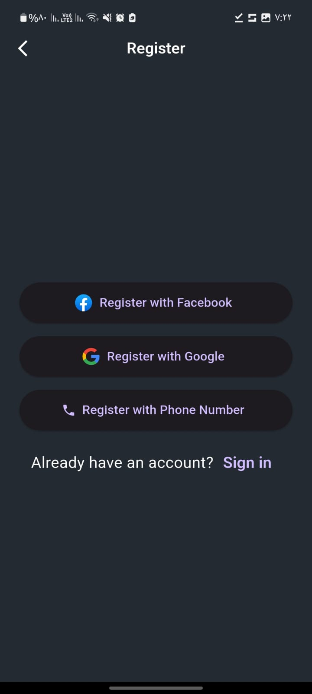
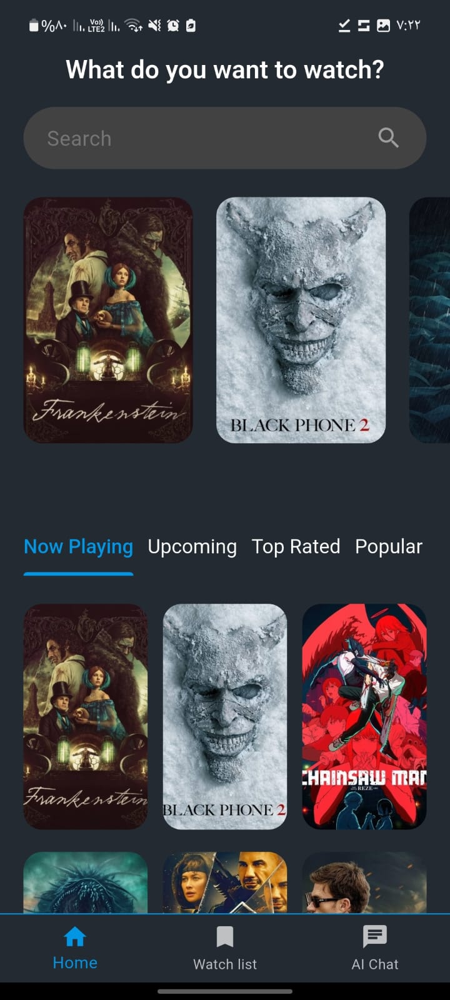
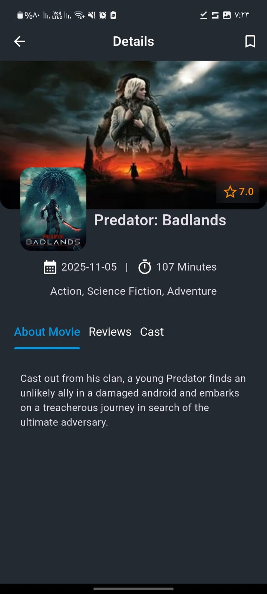
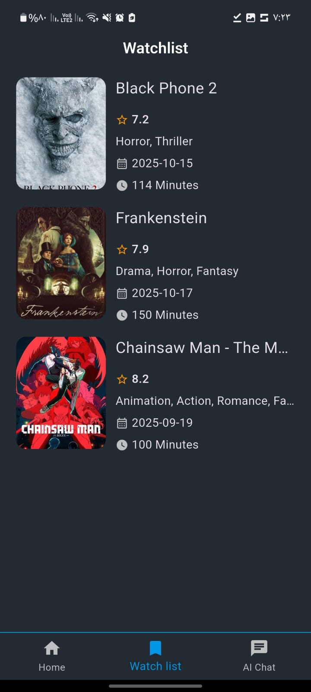

# Movies App


A Flutter application for browsing movies, managing a watchlist, and getting movie recommendations from an AI-powered chat.

## Features

*   **Authentication:** Users can sign up and log in using their email and password, Google account, or Facebook account. Phone number authentication is also supported.
*   **Browse Movies:** Users can browse through a list of movies, view movie details, and watch trailers.
*   **Search:** Users can search for movies by title.
*   **Watchlist:** Users can add movies to their watchlist and view them later.
*   **AI Chat:** Users can chat with an AI to get movie recommendations.
*   **Clean Architecture:** The project follows the clean architecture pattern, with a clear separation of concerns between the data, domain, and presentation layers.
*   **State Management:** The project uses the `flutter_bloc` package for state management.
*   **Routing:** The project uses the `go_router` package for declarative routing.
*   **Dependency Injection:** The project uses the `get_it` package for dependency injection.

## Screenshots

| Login | Register | Home |
| :---: | :---: | :---: |
|  |  |  |
| **Movie Details** | **Watchlist** | **AI Chat** |
|  |  |  |

## Tools Used

*   [Flutter](https://flutter.dev/) - A UI toolkit for building beautiful, natively compiled applications for mobile, web, and desktop from a single codebase.
*   [Dart](https://dart.dev/) - The programming language used to build Flutter apps.
*   [Firebase](https://firebase.google.com/) - A platform for building web and mobile applications.
    *   [Firebase Authentication](https://firebase.google.com/docs/auth) - For user authentication.
    *   [Firebase AI](https://firebase.google.com/docs/ml) - For the AI chat feature.
*   [Flutter BLoC](https://bloclibrary.dev/) - A predictable state management library for Dart.
*   [Go Router](https://pub.dev/packages/go_router) - A declarative routing package for Flutter.
*   [GetIt](https://pub.dev/packages/get_it) - A simple service locator for Dart and Flutter projects.
*   [Dio](https://pub.dev/packages/dio) - A powerful HTTP client for Dart.
*   [Retrofit](https://pub.dev/packages/retrofit) - A type-safe HTTP client for Dart and Flutter.
*   [Cached Network Image](https://pub.dev/packages/cached_network_image) - For caching network images.
*   [Freezed](https://pub.dev/packages/freezed) - A code generation for immutable classes.
*   [And many more...](pubspec.yaml)

## Getting Started

1.  Clone the repository:
    ```bash
    git clone https://github.com/Ahmed-Mamdouh-Elattar/movies_app.git
    ```
2.  Install the dependencies:
    ```bash
    flutter pub get
    ```
3.  Run the app:
    ```bash
    flutter run
    ```

**Note:** You will need to set up a Firebase project and add your own `google-services.json` file to the `android/app` directory and `GoogleService-Info.plist` to the `ios/Runner` directory.